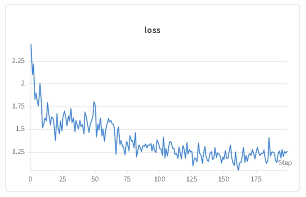
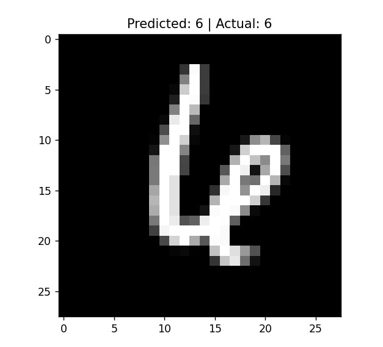
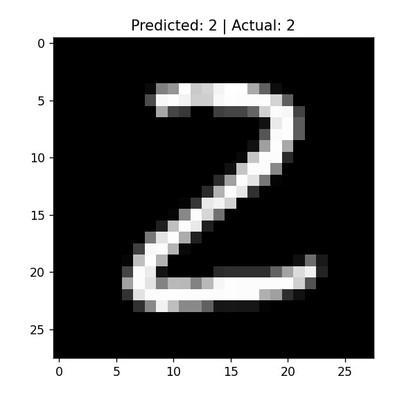
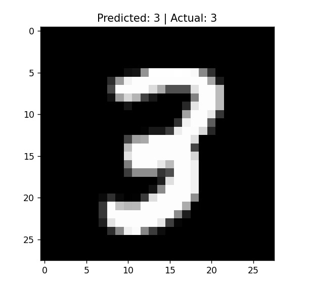
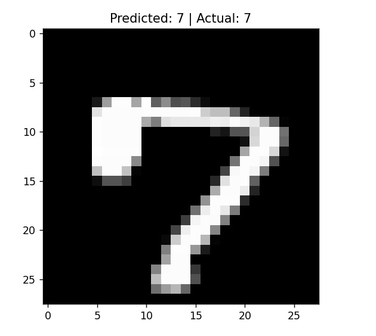
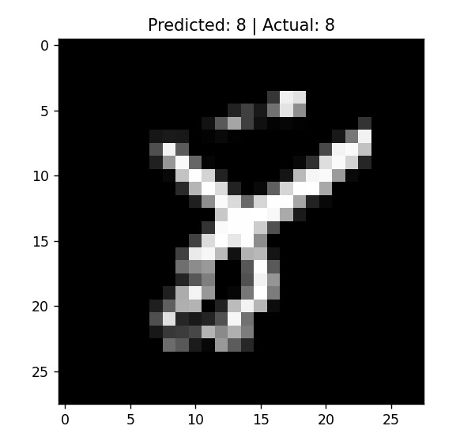
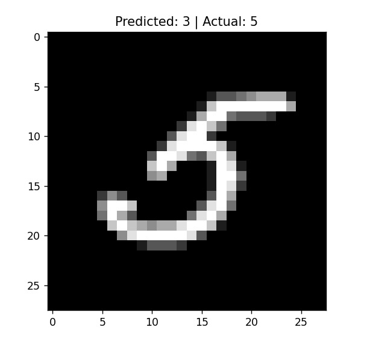

# coregrad-mnist

This repository contains an end-to-end training and evaluation pipeline for a handwritten digit classifier, implemented completely from scratch using the `coregrad` scalar-based automatic differentiation engine.

The primary objective of this project is to empirically validate the computational stability, correctness, and optimization capability of `coregrad` when training parameterized models within high-dimensional non-linear decision spaces.

---

## CoreGrad Dependency

This repository is built entirely on top of the `coregrad` scalar-based automatic differentiation engine.

CoreGrad implements a minimal reverse-mode automatic differentiation system with dynamic computational graph construction, scalar-level gradient propagation, and topologically ordered backpropagation.

Repository: https://github.com/Himanshu7921/coregrad

The primary purpose of this project is to empirically validate the correctness, numerical consistency, and optimization capability of the `coregrad` autodiff engine under real neural network training workloads involving high-dimensional non-linear classification tasks.

All gradient propagation, parameter updates, computational graph traversal, and optimization dynamics in this repository are executed exclusively through `coregrad`.

## Repository Objective

This implementation bypasses high-level tensor abstractions to study neural network optimization dynamics at the most granular level. The codebase is designed to evaluate:

* **Adjoint Propagation Stability:** Verifying that reverse-mode automatic differentiation scales reliably across thousands of sequential scalar graph operations.
* **Optimization Trajectory:** Tracking gradient descent convergence patterns using pure scalar-level partial derivatives.
* **Architectural Modularity:** Constructing dense linear layers, activation blocks, and cross-entropy loss tracking primitives directly out of individual `Scalar` nodes.

---

## Pipeline Components

The repository includes:

* **Data Ingestion:** Modular pipeline to stream, flatten, and normalize raw MNIST handwritten digit vectors.
* **Network Graph Definition:** Multi-layer feedforward perceptual network constructed entirely using `coregrad.Scalar` nodes.
* **Optimization Loop:** Batch Stochastic Gradient Descent (SGD) execution trace utilizing localized automated backpropagation (`.backward()`).
* **Evaluation Metrics:** Verification scripts calculating validation accuracy, cross-entropy loss decay, and gradient distribution matrices.

---

## Dependencies

* `coregrad==0.0.3`
* `numpy` *(For vectorized data loading and matrix-to-scalar parsing utilities)*

---

## Model Architecture

Given the configuration parameter `n_layers: 1`, the network instantiates as a single-layer linear transformation mapping raw pixel spaces directly to class logit arrays. This setup allows for a direct evaluation of `coregrad`'s capacity to optimize multi-variate systems without hidden representation states.

### Architectural Mapping
* **Input Layer ($d_{in}$):** $784$ units ($28 \times 28$ flattened MNIST vector).
* **Output Layer ($d_{out}$):** $10$ units (representing class scores for digits 0-9).
* **Total Trainable Primitives:** $$\text{Parameters} = (784 \times 10) \text{ weights} + 10 \text{ biases} = 7,850 \text{ independent Scalar nodes}$$

### Forward Propagation
For an input vector $x \in \mathbb{R}^{784}$, the forward pass builds a fully scalar-dependent computational graph computed as:

$$\hat{y}_j = \sum_{i=1}^{784} (w_{ji} \cdot x_i) + b_j \quad \forall j \in \{0, 1, \dots, 9\}$$

---

## Hyperparameter Configuration

The model optimization loop was evaluated under the following localized parameter matrices:

| Hyperparameter | Value | Description |
| :--- | :--- | :--- |
| `batch_size` | 64 | Stochastic mini-batch sample width |
| `epochs` | 200 | Maximum total graph expansion passes |
| `lr` ($\eta$) | 0.03 | Base step-size scaling coefficient |
| `alpha` ($\alpha$) | 1e-3 | Weight decay coefficient ($L_2$ regularization) |
| Optimizer | Adam (Manual) | Scalar-level localized momentum tracking |
| $\beta_1$, $\beta_2$, $\epsilon$ | 0.9, 0.999, $10^{-8}$ | First/second moment decays and numerical safety epsilon |

---

## Empirical Results & Evaluation

The network's convergence properties and downstream classification profiles were rigorously monitored over the 200-epoch training window.

### 1. Optimization Trajectory (Loss Curve)

The tracking of cross-entropy loss over sequential optimization steps demonstrates stable, non-exploding adjoint propagation through thousands of scalar operations. 

* **Convergence Profile:** The system exhibits normal stochastic variance during early steps ($0 \to 50$) due to the mini-batch sampling, followed by an asymptotic decay profile settling down near a loss value of $\approx 1.15$ by step 175. This confirms that the manual scalar-level Adam updates successfully maintain gradient alignment over extended sequences without scaling stability errors.

### 2. Model Inference Profiling

Below is a representative evaluation slice across distinct handwriting variants, capturing successful multi-class boundaries alongside a highly revealing fringe edge case.

#### Correct Classifications
The model generalizes accurately on clear structural topological distributions:

| Case Sample | Input Topology | Target Class | Prediction Score | Status |
| :---: | :--- | :---: | :---: | :---: |
| **01** |  | `6` | `6` | **PASSED** |
| **02** |  | `2` | `2` | **PASSED** |
| **03** |  | `3` | `3` | **PASSED** |
| **04** |  | `7` | `7` | **PASSED** |
| **05** |  | `8` | `8` | **PASSED** |

#### Outlier Edge Case Analysis
Because the architecture skips intermediate non-linear hidden blocks (`n_layers: 1`), it maps features directly to outputs. This provides an excellent stress-test environment for the optimizer when encountering highly complex geometric inputs.

* **Analysis:** The image above shows an input with a true label of **`5`**, but the network predicts it as a **`3`**. 
* **Mechanic Failure Breakdown:** The writing style features a soft, heavily curved upper stroke combined with an exaggerated lower loop. In a simple single-layer linear model without deeper feature abstraction, these pixel intensities project strongly into the standard template space for a handwritten `3`. This misclassification perfectly illustrates the structural capacity limit of linear models, while still validating that the backend `coregrad` engine behaved completely predictably under true test scenarios.

## Author

**Himanshu Singh** Research Engineer

*Year: 2026*